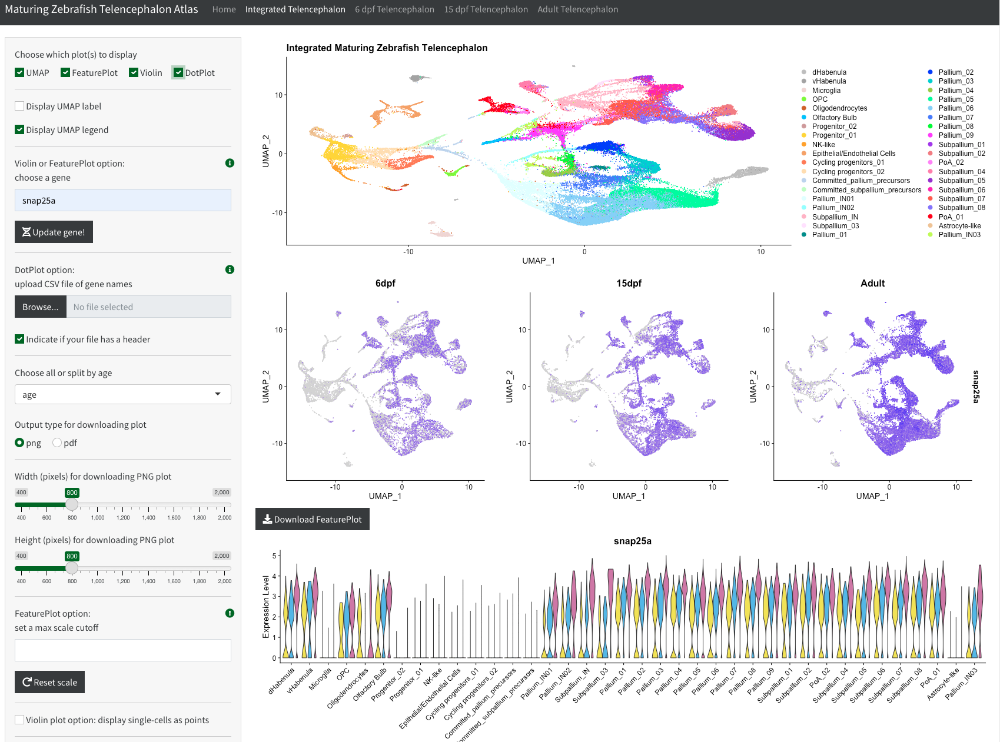

# A single-cell transcriptome atlas of the maturing zebrafish telencephalon
A R Shiny app of the transcriptome atlas of the maturing zebrafish telencephalon

<!-- TODO: ### Citation [once link is available] -->
## App overview

The app provides a user-friendly approach to explore the single-cell data from the maturing zebrafish telencephalon across the 6dpf, 15dpf and adult ages (integrated and individual age-specific datasets). The general functionality of the app includes:

* Searchable browser for genes/features to be plotted as violin plots and feature plots.
* Dot plots of features (maximum number of features set to 60 as a sensible default linked to width of the plot)
* User choices to split the integrated dataset per age, download figures (png/pdf) and plot a subset of clusters of interest.

An overview of the tab which contains the integrated dataset (split per age) can be seen below:



<br>

# App deployment with Docker

The app, along with all dependencies have been containerized with Docker and is hosted in the following Docker Hub repository: <https://hub.docker.com/repository/docker/uabbds/zebrafish_telencephalon_atlas_app>

Overall, the user needs to 1. install Docker 2. [follow the instructions below for deployment](#deploy-app-locally).

> :warning: **NOTE for Windows users**: please ensure you install Docker with admin privileges (`Run as administrator` option) and have the WSL 2 Linux Kernel installed. [See more directions on Docker for Windows in the docs](https://docs.docker.com/desktop/install/windows-install/). General familiarity with setting Docker resources is strongly encouraged - e.g.: `.wslconfig` file and use of the `docker run -m` flag to set memory limit (`-m 6000m`)

> :warning: **NOTE for Mac users with M1 chip**: rocker/rstudio images do not currently work with arm Macs/Macs with the M1 chip. This is a [known issue from the rocker group](https://github.com/rocker-org/rocker-versioned2/issues/144) and is expected to be solved in 2023. We are actively watching this issue and will update the Docker image once it is fixed. Macs without the M1 chips work perfectly fine.
## Deploy app locally

To run the container, run the following command:

```
docker run -a STDOUT --rm --user shiny -p 3838:3838 -v ${PWD}:/var/log/shiny-server uabbds/zebrafish_telencephalon_atlas_app:latest
```

Open your browser, and go to the following localhost <http://localhost:3838> . Loading times are variable on your computer (OS should follow recommended specs by Docker). Log statements have been added to the app to provide users with progress. Once the command above is executed, you may see the following:

```
[2023-01-05T21:20:01.422] [INFO] shiny-server - Shiny Server v1.5.20.1002 (Node.js v16.18.1)
[2023-01-05T21:20:01.424] [INFO] shiny-server - Using config file "/etc/shiny-server/shiny-server.conf"
[2023-01-05T21:20:01.470] [INFO] shiny-server - Starting listener on http://[::]:3838
[2023-01-05T21:20:26.739] [INFO] shiny-server - created bookmark state directory: /var/lib/shiny-server/bookmarks
[2023-01-05T21:20:26.740] [INFO] shiny-server - created user bookmark state directory: /var/lib/shiny-server/bookmarks/shiny
[2023-01-05T21:20:27.543] [INFO] shiny-server - [/srv/shiny-server:18] (2023-01-05 21:20:27 UTC) LOG: Loading packages.

...# truncated for example

[2023-01-05T21:20:31.872] [INFO] shiny-server - [/srv/shiny-server:18] (2023-01-05 21:20:31 UTC) LOG: All packages loaded.
[2023-01-05T21:20:31.893] [INFO] shiny-server - [/srv/shiny-server:18] (2023-01-05 21:20:31 UTC) LOG: Reading in integrated forebrain RDS.
[2023-01-05T21:20:36.895] [INFO] shiny-server - [/srv/shiny-server:18] (2023-01-05 21:20:36 UTC) LOG: Reading in dpf6 RDS.
[2023-01-05T21:20:38.244] [INFO] shiny-server - [/srv/shiny-server:18] (2023-01-05 21:20:38 UTC) LOG: Reading in dpf15 RDS.
[2023-01-05T21:20:39.553] [INFO] shiny-server - [/srv/shiny-server:18] (2023-01-05 21:20:39 UTC) LOG: Reading in adult RDS.
[2023-01-05T21:20:41.610] [INFO] shiny-server - [/srv/shiny-server:18] (2023-01-05 21:20:41 UTC) LOG: All RDS data has been loaded.
[2023-01-05T21:20:41.616] [INFO] shiny-server - [/srv/shiny-server:18] (2023-01-05 21:20:41 UTC) LOG: Reading in integrated forebrain cluster names.
[2023-01-05T21:20:41.620] [INFO] shiny-server - [/srv/shiny-server:18] (2023-01-05 21:20:41 UTC) LOG: Reading in dpf6 cluster names.
[2023-01-05T21:20:41.622] [INFO] shiny-server - [/srv/shiny-server:18] (2023-01-05 21:20:41 UTC) LOG: Reading in dpf15 cluster names.
[2023-01-05T21:20:41.625] [INFO] shiny-server - [/srv/shiny-server:18] (2023-01-05 21:20:41 UTC) LOG: Reading in adult cluster names.
[2023-01-05T21:20:41.627] [INFO] shiny-server - [/srv/shiny-server:18] (2023-01-05 21:20:41 UTC) LOG: All cluster names have been loaded.
[2023-01-05T21:20:41.627] [INFO] shiny-server - [/srv/shiny-server:18] (2023-01-05 21:20:41 UTC) LOG: Initializing UI.
[2023-01-05T21:20:41.628] [INFO] shiny-server - [/srv/shiny-server:18] (2023-01-05 21:20:41 UTC) LOG: UI Initialized.
[2023-01-05T21:20:41.628] [INFO] shiny-server - [/srv/shiny-server:18] (2023-01-05 21:20:41 UTC) LOG: Initializing Session.
[2023-01-05T21:20:41.629] [INFO] shiny-server - [/srv/shiny-server:18] (2023-01-05 21:20:41 UTC) LOG: Session Initialized.
```

Further, a copy of the log can also be found in the current working directory which should be  mounted in the `docker run` command displayed above. If an issue is found, please inspect the log file (file with pattern `shiny-server-shiny-*.log`)